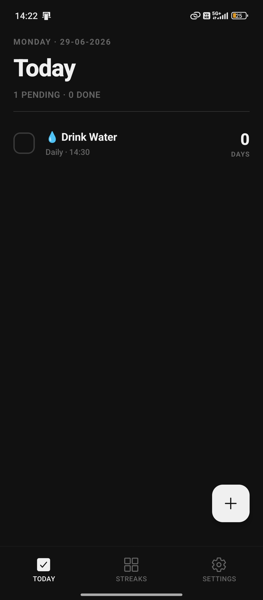
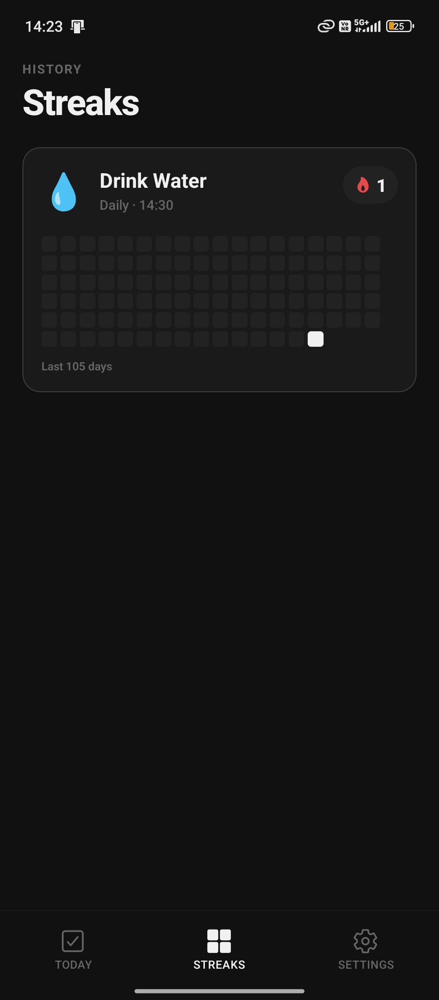
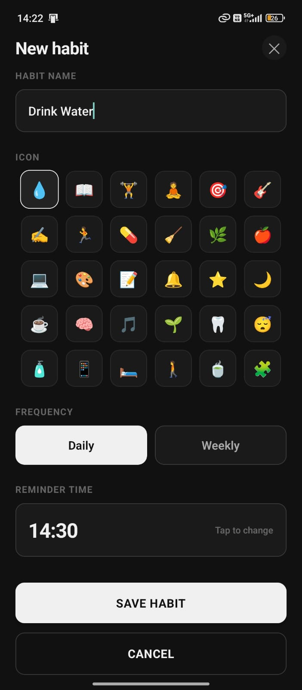
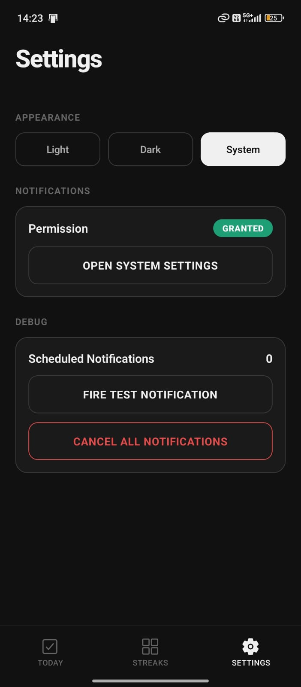
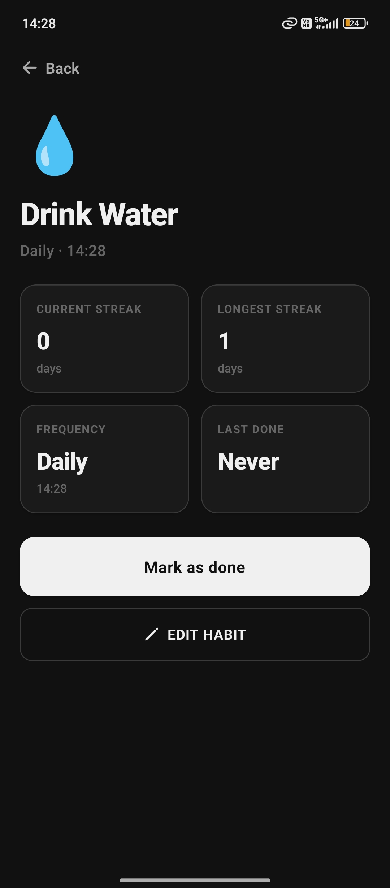
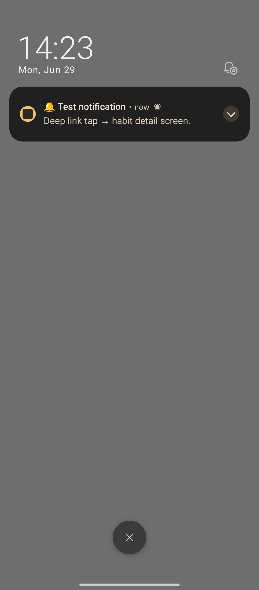

# ⚡ Streaks
*only local notification is implemented (there is some error in my firebase account as I'm not able to create any other project) but I setup the code for push notifications*

Streaks is a minimalist, high-performance habit tracker designed to help you stay consistent. Built with **React Native** and **Expo**, Streaks focuses on a frictionless experience—no bloat, just the data you need to keep your momentum going.

---

## 📸 Preview

| Home Screen | Streaks Screen | Create Screen | Settings Screen | Detail Screen | Test Notification |
| :---: | :---: | :---: | :---: | :---: | :---: |
|  |  |  |  |  | |

[**▶ Watch the Demo Video**](https://youtube.com/shorts/-9Dt36WB-v4?si=KJuRo7CQ0PEDSRI-)

---

## ✨ Key Features
* **Minimalist Interface:** Clean, distraction-free design to keep you focused on your habits.
* **Flexible Scheduling:** Support for daily and custom weekly habit scheduling.
* **Progress Visualization:** Visual heatmap for tracking consistency over the last 105 days.
* **Smart Reminders:** Local notification system to keep you on track, even when the app is closed.
* **Streak Tracking:** Automatic calculation of your current momentum for every habit.
* **Dark Mode Support:** Built-in theme switching for comfortable usage in any lighting.

---

## 🛠 Tech Stack
* **Framework:** [Expo](https://expo.dev) / [React Native](https://reactnative.dev)
* **Routing:** [Expo Router](https://docs.expo.dev/router/introduction)
* **Storage:** [Expo SQLite](https://docs.expo.dev/versions/latest/sdk/sqlite)
* **Notifications:** [Expo Notifications](https://docs.expo.dev/versions/latest/sdk/notifications)
* **Haptics:** [Expo Haptics](https://docs.expo.dev/versions/latest/sdk/haptics)
